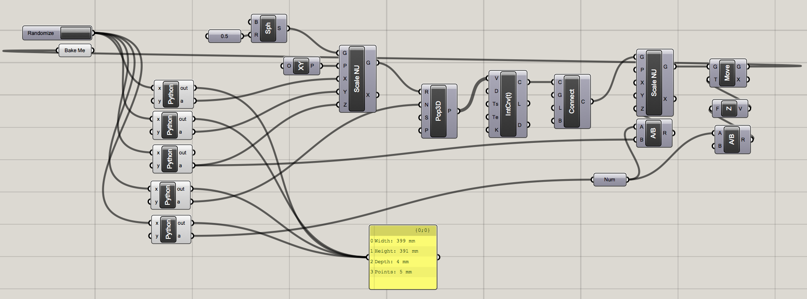
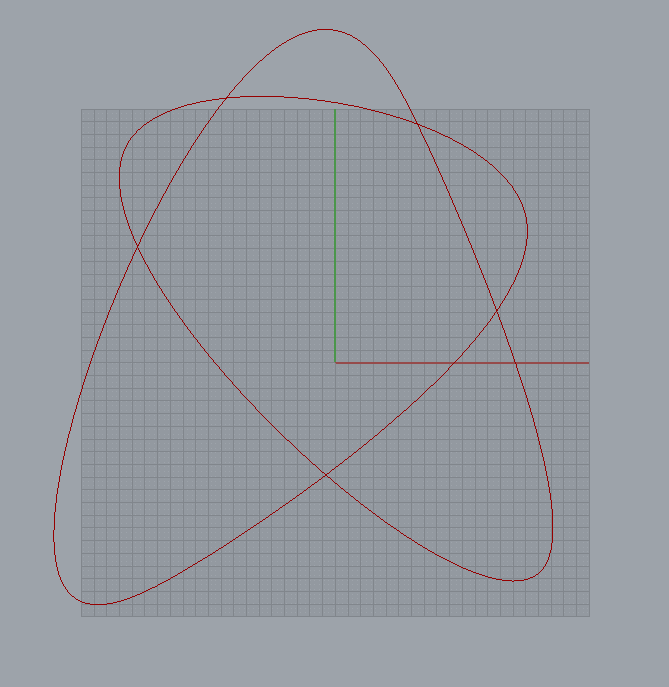

This is the algorithm.

----------------------------------------------

This is a 3D model.

----------------------------------------------

This is some g-code:
<pre>
G1 F1000 X140.39 Y-136.97 Z-0.76 E762145.86
G1 F1000 X140.15 Y-137.46 Z-0.77 E762689.58
G1 F1000 X139.88 Y-137.91 Z-0.78 E763215.83
G1 F1000 X139.61 Y-138.34 Z-0.79 E763726.26
G1 F1000 X139.31 Y-138.74 Z-0.8 E764222.66
G1 F1000 X139 Y-139.11 Z-0.81 E764706.91
G1 F1000 X138.67 Y-139.45 Z-0.83 E765180.98
G1 F1000 X138.33 Y-139.76 Z-0.84 E765646.93
G1 F1000 X137.97 Y-140.05 Z-0.85 E766106.9
G1 F1000 X137.59 Y-140.31 Z-0.86 E766563.04
G1 F1000 X137.2 Y-140.54 Z-0.87 E767017.52
G1 F1000 X136.8 Y-140.75 Z-0.88 E767472.49
G1 F1000 X136.37 Y-140.93 Z-0.89 E767930.02
G1 F1000 X135.94 Y-141.08 Z-0.9 E768392.14
G1 F1000 X135.49 Y-141.2 Z-0.91 E768860.75
G1 F1000 X135.02 Y-141.3 Z-0.92 E769337.63
G1 F1000 X134.54 Y-141.37 Z-0.93 E769824.44
G1 F1000 X134.04 Y-141.42 Z-0.94 E770322.69
G1 F1000 X133.53 Y-141.44 Z-0.96 E770833.74
G1 F1000 X133.01 Y-141.44 Z-0.97 E771358.84
G1 F1000 X132.47 Y-141.41 Z-0.98 E771899.07
G1 F1000 X131.91 Y-141.35 Z-0.99 E772455.42
G1 F1000 X131.35 Y-141.27 Z-1 E773028.73
G1 F1000 X130.77 Y-141.17 Z-1.01 E773619.77
G1 F1000 X130.17 Y-141.04 Z-1.02 E774229.17
G1 F1000 X129.56 Y-140.88 Z-1.03 E774857.51
G1 F1000 X128.94 Y-140.71 Z-1.05 E775505.28
G1 F1000 X128.3 Y-140.5 Z-1.06 E776172.88
G1 F1000 X127.65 Y-140.28 Z-1.07 E776860.68
G1 F1000 X126.31 Y-139.76 Z-1.09 E778297.87
G1 F1000 X124.92 Y-139.14 Z-1.11 E779818.76
G1 F1000 X123.48 Y-138.44 Z-1.14 E781424.51
G1 F1000 X121.99 Y-137.64 Z-1.16 E783115.75
G1 F1000 X120.45 Y-136.76 Z-1.18 E784892.71
G1 F1000 X117.22 Y-134.73 Z-1.23 E788702.85
G1 F1000 X113.81 Y-132.38 Z-1.28 E792851.62
G1 F1000 X110.21 Y-129.7 Z-1.32 E797332.44
G1 F1000 X106.45 Y-126.71 Z-1.37 E802136.74
G1 F1000 X98.45 Y-119.85 Z-1.46 E812674.37
G1 F1000 X89.86 Y-111.91 Z-1.56 E824375.31
G1 F1000 X80.74 Y-102.98 Z-1.65 E837140.16
G1 F1000 X61.16 Y-82.55 Z-1.82 E865438.02
G1 F1000 X18.34 Y-34.2 Z-2.14 E930018.47
</pre>
