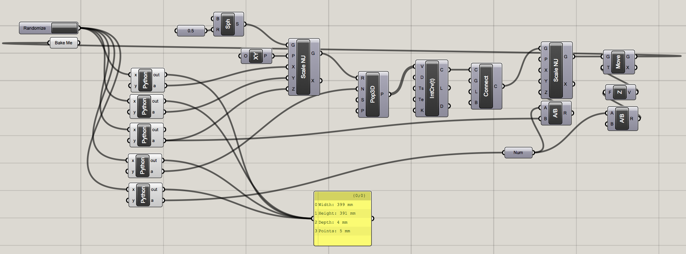
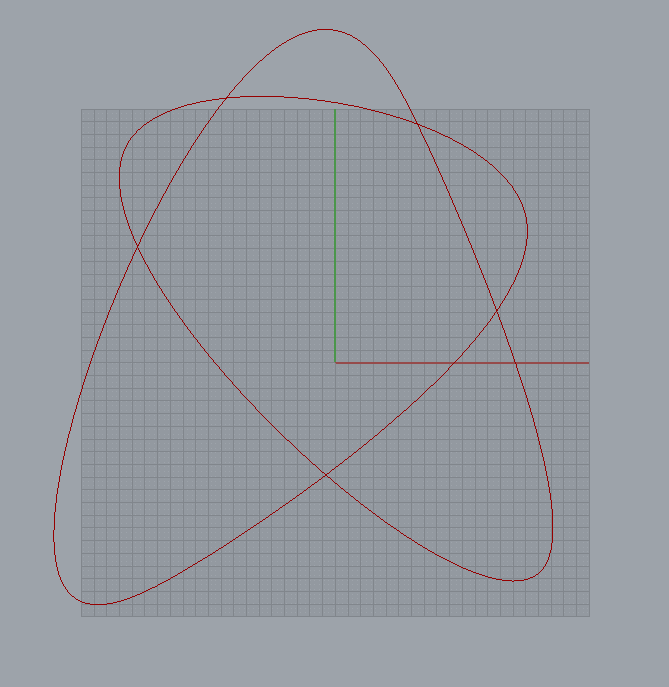

<h1> Machine Drawing </h1>

- machineDrawing.ghx is the grasshopper file used to draw the model
- machineDrawing.3dm is the rhino file used to view the model
configForPrusaMendel.ini are settings to generate gcode
- serial-port-json-server is used to set up the server draw the model (using chillipeppr)

----------------------------------------------

This is the algorithm. (machineDrawing.ghx)

----------------------------------------------

This is a 3D model. (machineDrawing.3dm)

----------------------------------------------

This is some g-code (gCode.nc):
<pre>
X8.63 Y-5.88 Z-3.24
X12.41 Y-2.36 Z-3.28
X14.2 Y-0.58 Z-3.29
X15.9 Y1.21 Z-3.31
X17.48 Y3 Z-3.32
X18.95 Y4.77 Z-3.34
X20.27 Y6.53 Z-3.35
X20.87 Y7.41 Z-3.36
X21.43 Y8.27 Z-3.37
X21.94 Y9.13 Z-3.37
X22.41 Y9.97 Z-3.38
X22.83 Y10.81 Z-3.38
X23.2 Y11.63 Z-3.39
X23.37 Y12.04 Z-3.39
X23.52 Y12.45 Z-3.39
</pre>
